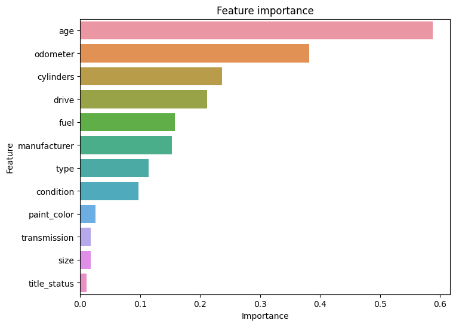

# BHMLAI-Application11: Used Car Price Determinants: An Analysis

## Overview

In this application, you will explore a dataset from kaggle. The original dataset contained information on 3 million used cars. The provided dataset contains information on 426K cars to ensure speed of processing.  Your goal is to understand what factors make a car more or less expensive.  As a result of your analysis, you should provide clear recommendations to your client -- a used car dealership -- as to what consumers value in a used car.

## Business understanding

The primary aim of this analysis is to understand the factors that contribute to a car's price. By using a dataset containing details about 426,000 cars, we performed an in-depth examination and modeling to elucidate the elements that make a car more or less expensive. Our findings will help our client, a used car dealership, to better understand consumer preferences in a used car and optimize their inventory accordingly.

In the used car business, pricing is key. Our client, a used car dealership, wants to understand the factors that make a car more or less expensive in order to optimize their purchasing and pricing strategies. By understanding what consumers value in a used car, the dealership can make more informed decisions regarding the vehicles they buy and sell, and how they price them. This could potentially increase their profitability and customer satisfaction.

## Data

The dataset is an extract of 426,880 used cars from Craigslist (from a 3 million record source). Each row represents a car, and each column represents an attribute of the car. The dataset contains the following attributes:

    * region        : Craigslist region where the car is being sold
    * price         : advertised price of the car
    * year          : model year of the car
    * manufacturer  : manufacturer name 
    * model         : model name 
    * condition     : condition of the car (excellent, good, like new, etc.)
    * cylinders     : number of cylinders
    * fuel          : fuel type (gas, diesel, etc.)
    * odometer      : number of miles the car has been driven
    * title_status  : title status (clean, missing, etc.)
    * transmission  : transmission type (automatic, manual, etc.)
    * VIN           : vehicle identification number
    * drive         : drive type (fwd, rwd, etc.)
    * size          : size of the car (compact, mid-size, etc.)
    * type          : type of the car (SUV, sedan, etc.)
    * paint_color   : color of the car
    * state         : state where the car is being sold

More detail from the Exploratory Data Analysis, Data Preparation, Model building and Evaluation is provided in the [notebook](prompt_II.ipynb).

## Key Findings

1. **Age of the Car**: The car's age is a significant factor in its price. Generally, the older a car is, the less it's worth. Your dealership could improve its profitability by focusing on newer used cars.

2. **Odometer Reading (Mileage)**: Cars with less mileage usually have a better condition and longer lifespan, making them more valuable. You might want to focus on sourcing cars with lower mileage.

3. **Number of Cylinders**: A car's price can be influenced by the number of cylinders it has. Cars with more cylinders typically have stronger engines, which can be appealing to some customers.

4. **Drive Type**: Whether a car is front-wheel, rear-wheel, or four-wheel drive can affect its price. Depending on the local climate and customer preferences, certain drive types may be more popular.

5. **Fuel Type**: The fuel type a car uses plays a role in its price. With an increasing trend towards eco-friendly vehicles, hybrid and electric cars could command higher prices.

6. **Manufacturer**: The brand or manufacturer of a car also matters. Cars from manufacturers known for quality, reliability, or luxury can often be sold for higher prices.

7. **Car Type**: The style of the car, whether it's an SUV, sedan, truck, etc., can influence its price. Understanding the demand for different types of cars in your market could help you optimize your inventory.

8. **Condition**: As expected, a car in excellent condition is generally more valuable. The better the condition, the higher the price it can command.

9. **Paint Color, Transmission, Size and Title Status**: While less influential, still contribute to its overall value.

By understanding these factors, you can make strategic choices in selecting and pricing cars for your dealership, which could potentially maximize your profitability.

## Next Steps

This analysis is just the starting point, and it concentrates on the relationship between car descriptions and their prices. Given more comprehensive data or a larger dataset, we could enhance both the precision and utility of our model. It might also be beneficial to extend the analysis to include other business aspects like sales conditions and customer information.

Our model could benefit from an enhanced data preparation phase. This could involve pulling more detailed information from the Vehicle Identification Number (VIN), which might allow us to more accurately determine factors such as the number of cylinders, vehicle size, fuel type, and transmission type. Additionally, securing information about the original price of the car could be helpful in assessing its depreciation rate.

Increasing the amount of data fed into the model could lead to longer training times but also potentially improve its performance. This might involve incorporating previously discarded features like the car model and region, utilizing the complete dataset of 3 million records, or integrating data from other sources such as the Kelly Blue Book.

Furthermore, collecting data related to dealership operations, like sales time frames, numbers of vehicles sold, current inventory size, and others, could be beneficial. This additional data could enable us to provide better advice on optimizing your inventory management.

We're excited about the opportunity to further help optimize your inventory and boost your dealership's profitability.
